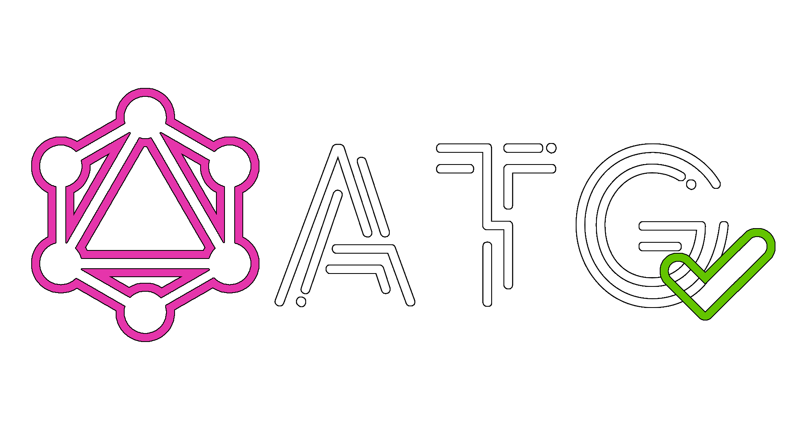

 

  

# graphql-atg

GraphQL Automated Test Generator (ATG) generates automatic tests for you API by fetching the GraphQL introspection schema and by automatically generating requests for that API.

It aims to help you perform E2E testing more simply and make those tests easier to maintain.

It also aim to verify backward compatibility of your API by running the same queries that were executed in a previous API version again and creating verification reports.

> This project is under development at the moment, so don't bother using it right now, but feel free to leave a star if this interests you :)
